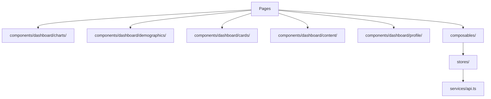
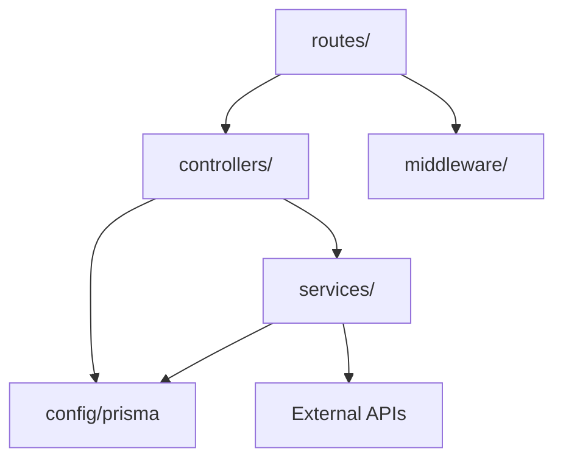

# Gelitik Architecture Review

> Deep dive into backend and frontend architecture with refactoring recommendations.
> Reviewed: 2026-03-03

---

## Frontend Architecture

### Current Structure

```
frontend/src/
├── components/
│   ├── auth/          (4 files)  ✅ Well-scoped
│   ├── dashboard/     (23 files) ⚠️  Flat mega-folder
│   ├── layout/        (7 files)  ✅ Well-scoped
│   ├── loading/       (5 files)  ✅ Well-scoped
│   ├── schedule/      (5 files)  ✅ Well-scoped
│   ├── ui/            (9 files)  ✅ Well-scoped
│   └── index.ts
├── composables/       (10 files)
├── pages/             (13 files)
├── stores/            (5 files)
├── types/             (5 files)
├── utils/             (2 files)
├── router/
└── services/
```

Every subdirectory is well-organized **except `components/dashboard/`**, which is a flat folder of 22 components mixing 5 unrelated concerns:

### Problem: `components/dashboard/` is a Grab Bag

| Concern                    | Components                                                                                                                                                                 | Consumers                          |
| -------------------------- | -------------------------------------------------------------------------------------------------------------------------------------------------------------------------- | ---------------------------------- |
| **Charts & Visualization** | `AudienceChart`, `EngagementChart`, `EngagementDoughnutChart`, `VideoPerformanceChart`, `TopVideosChart`, `BestTimeHeatmap`, `DualChartDashboard`, `ChartTimeframeControl` | Dashboard, TikTok, Instagram pages |
| **Demographics**           | `GenderSplitPanel`, `TopCitiesPanel`, `AgeRangePanel`, `DeviceTypePanel`, `TerritoryPanel`                                                                                 | Instagram page only                |
| **Cards & KPIs**           | `StatCard`, `InsightCard`, `BrutalBadge`, `MarqueeBanner`                                                                                                                  | All dashboard pages                |
| **Content & Video**        | `ContentTable`, `ContentFormatBreakdown`, `VideoDetailModal`                                                                                                               | All dashboard pages                |
| **Profile & Platform**     | `UserProfile`, `PlatformHealthComparison`                                                                                                                                  | Dashboard, TikTok, Instagram pages |

**Why this matters:**

- 22 components in one flat directory makes files hard to locate
- No discoverability — a new developer doesn't know which components relate to which feature
- Demographics components are **only used by Instagram** but live alongside TikTok-specific components
- Barrel export (`index.ts`) lists all 20 components — importing anything pulls in the entire module map

### Proposed: Organized by Feature Domain

```
components/dashboard/
├── charts/
│   ├── AudienceChart.vue
│   ├── EngagementChart.vue
│   ├── EngagementDoughnutChart.vue
│   ├── VideoPerformanceChart.vue
│   ├── TopVideosChart.vue
│   ├── BestTimeHeatmap.vue
│   ├── DualChartDashboard.vue
│   ├── ChartTimeframeControl.vue
│   └── index.ts
├── demographics/
│   ├── GenderSplitPanel.vue
│   ├── TopCitiesPanel.vue
│   ├── AgeRangePanel.vue
│   ├── DeviceTypePanel.vue
│   ├── TerritoryPanel.vue
│   └── index.ts
├── cards/
│   ├── StatCard.vue
│   ├── InsightCard.vue
│   ├── BrutalBadge.vue
│   ├── MarqueeBanner.vue
│   └── index.ts
├── content/
│   ├── ContentTable.vue
│   ├── ContentFormatBreakdown.vue
│   ├── VideoDetailModal.vue
│   └── index.ts
├── profile/
│   ├── UserProfile.vue
│   ├── PlatformHealthComparison.vue
│   └── index.ts
└── index.ts          ← re-exports all subdirectories
```

**Benefits:**

- Clear feature boundaries — demographics is obviously Instagram-related
- Scoped barrel exports — import only what you need
- Consistent with the rest of the project (auth, layout, schedule are already grouped)
- New developers can find components by domain, not by scrolling 22 files

---

## Backend Architecture

### Current Structure

```
backend/src/
├── app.ts                           ← Express setup + middleware
├── config/ (6 files)                ✅ Well-organized
│   ├── prisma.ts, env.ts, encryption.ts,
│   ├── passport.ts, oauthState.ts, oauthStateDb.ts
├── controllers/ (1 file)           ⚠️  Only auth.controller.ts
│   └── auth.controller.ts
├── middleware/ (4 files)            ⚠️  2 duplicate auth files
│   ├── auth.middleware.ts, auth.ts,
│   ├── errorHandler.ts, validation.ts
├── routes/ (6 files)               ⚠️  Contains business logic
│   ├── auth.routes.ts    (148 lines)
│   ├── analytics.routes.ts (306 lines)
│   ├── analytics.ts      (306 lines)  ← duplicate naming?
│   ├── auth.ts           (varies)
│   ├── socialAccounts.ts (301 lines)
│   └── instagramGraph.routes.ts (100 lines)
├── services/ (6 files)
│   ├── instagramGraph.service.ts (649 lines) ⚠️  Monolith
│   ├── tiktokService.ts (295 lines)
│   ├── instagram.service.ts, email.service.ts
│   ├── platform.interface.ts, tokenManager.ts
├── jobs/ (1 file)                  ✅
├── types/ (1 file)
└── utils/ (1 file)
```

### Problem 1: Abandoned Controller Pattern

The project started with a proper **Route → Controller → Service** layering (visible in `auth.controller.ts`), but abandoned it for all other features:

```
✅ Auth flow:  auth.routes.ts → AuthController → (various services)
❌ Analytics:  analytics.routes.ts → (Prisma + services directly, 306 lines)
❌ Accounts:  socialAccounts.ts → (Prisma + services directly, 301 lines)
```

`analytics.routes.ts` alone handles:

- Request validation and parameter parsing
- Prisma queries for account lookup
- Service orchestration (Instagram, TikTok, Instagram Graph)
- Date range calculation
- Analytics snapshot recording (30+ lines of `upsert` logic)
- Response formatting

**Recommendation:** Extract controllers for `analytics` and `socialAccounts`:

```
routes/analytics.routes.ts     → thin routing layer
controllers/analytics.controller.ts → request/response handling
services/analytics.service.ts  → snapshot logic + orchestration
```

### Problem 2: Duplicate Route Files

Two pairs of files serve overlapping purposes:

| Pair             | File 1                          | File 2                | Problem                                   |
| ---------------- | ------------------------------- | --------------------- | ----------------------------------------- |
| Auth middleware  | `middleware/auth.middleware.ts` | `middleware/auth.ts`  | Different JWT payloads (`id` vs `userId`) |
| Analytics routes | `routes/analytics.routes.ts`    | `routes/analytics.ts` | Both 306 lines, ambiguous naming          |

**Recommendation:** Delete the unused files and consolidate.

### Problem 3: `instagramGraph.service.ts` Monolith (649 lines)

This single file handles 8 distinct responsibilities:

```
1. OAuth token exchange         (~50 lines)
2. Token refresh                (~20 lines)
3. Instagram account discovery  (~30 lines)
4. Profile fetching             (~15 lines)
5. Account insights (7 API calls) (~265 lines)
6. Media with batch insights    (~80 lines)
7. Full analytics aggregation   (~65 lines)
8. Engagement rate calculation  (~15 lines)
```

**Proposed split:**

```
services/instagram/
├── instagramAuth.service.ts      ← OAuth + token refresh
├── instagramInsights.service.ts  ← Account + media insights
├── instagramMedia.service.ts     ← Media fetching + batch operations
├── instagramAnalytics.service.ts ← Aggregation + engagement calculation
└── index.ts                      ← Re-exports InstagramGraphService facade
```

### Problem 4: No Request/Response Types

Routes use `(req.user as any)` in 15+ locations across all route files. There are no typed request/response interfaces for the API endpoints.

**Recommendation:** Define request/response DTOs:

```typescript
// types/api.ts
interface AnalyticsRequest {
  platform: "instagram" | "instagram-graph" | "tiktok";
  timeframe?: string;
  startDate?: string;
  endDate?: string;
}

interface AnalyticsResponse {
  account: SanitizedAccount;
  data: PlatformAnalyticsData;
}
```

---

## Proposed Target Architecture

### Frontend



### Backend



---

## Priority Actions

| #   | Action                                                | Effort                            | Impact                           |
| --- | ----------------------------------------------------- | --------------------------------- | -------------------------------- |
| 1   | **Split `components/dashboard/` into subdirectories** | Low — move files + update imports | High — immediate discoverability |
| 2   | **Delete duplicate middleware/route files**           | Low — delete 2 files              | High — removes confusion         |
| 3   | **Extract analytics controller**                      | Medium — refactor 306-line route  | High — proper layering           |
| 4   | **Split `instagramGraph.service.ts`**                 | Medium — separate concerns        | Medium — maintainability         |
| 5   | **Add API request/response types**                    | Medium — define interfaces        | Medium — type safety             |
| 6   | **Extract social accounts controller**                | Medium — refactor 301-line route  | Medium — consistency             |
